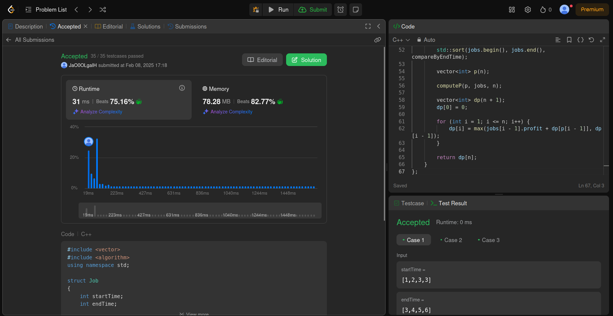
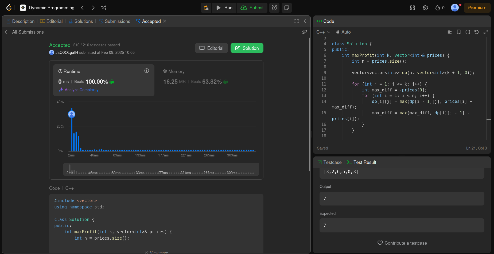

# LeetCodeProblemas

**Número da Lista**: 20 
**Conteúdo da Disciplina**: Programação Dinâmica (PD) 

## Alunos
| Matrícula  | Aluno                          |
| ---------- | ------------------------------ |
| 22/1021886 | Cássio Sousa dos Reis          |
| 22/1039497 | Márcio Henrique de Sousa Costa |

## Sobre 
Este projeto tem como objetivo a resolução de exercícios da plataforma de juíz online LeetCode sobre o conteúdo de Programação Dinâmica (PD).

## Questões

| Nome                                                                                                                     | Dificuldade |
| ------------------------------------------------------------------------------------------------------------------------ | ----------- |
| [1235. Maximum Profit in Job Scheduling](https://leetcode.com/problems/maximum-profit-in-job-scheduling/description/)    | Difícil     |
| [188. Best Time to Buy and Sell Stock IV](https://leetcode.com/problems/best-time-to-buy-and-sell-stock-iv/description/) | Difícil     |
| [44. Wildcard Matching](https://leetcode.com/problems/wildcard-matching/description/)                                    | Difícil     |
| [62. Unique Paths](https://leetcode.com/problems/unique-paths/description/)                                              | Médio       |

## Screenshots
Adicione 3 ou mais screenshots do projeto em funcionamento.

**62. Unique Paths** 

**44. Wildcard Matching** 

**1235. Maximum Profit in Job Scheduling**

**188. Best Time to Buy and Sell Stock IV**

## Instalação 
**Linguagem**: C++, Python3.x 

## Uso 
Para rodar os códigos, primeiro acesse o site do [LeetCode](https://leetcode.com), faça login e pesquise a questão. Depois, selecione a linguagem correta, copie e cole o código na aba "Code", e clique em "Run" para testar ou "Submit" para enviar a solução.

## Outros 
Quaisquer outras informações sobre seu projeto podem ser descritas abaixo.

## Vídeos

**62. Unique Paths**

<iframe width="560" height="315" src="https://www.youtube.com/embed/koUjqkS8uGU?si=KgRmXRhQgs2s4HVN" title="YouTube video player" frameborder="0" allow="accelerometer; autoplay; clipboard-write; encrypted-media; gyroscope; picture-in-picture; web-share" referrerpolicy="strict-origin-when-cross-origin" allowfullscreen></iframe>

**44. Winldcard Matching** 

<iframe width="560" height="315" src="https://www.youtube.com/embed/Qxxs4czwOuw?si=K37NshSDb8U6z_we" title="YouTube video player" frameborder="0" allow="accelerometer; autoplay; clipboard-write; encrypted-media; gyroscope; picture-in-picture; web-share" referrerpolicy="strict-origin-when-cross-origin" allowfullscreen></iframe>