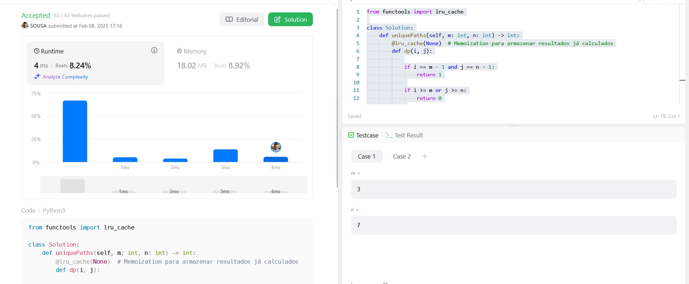
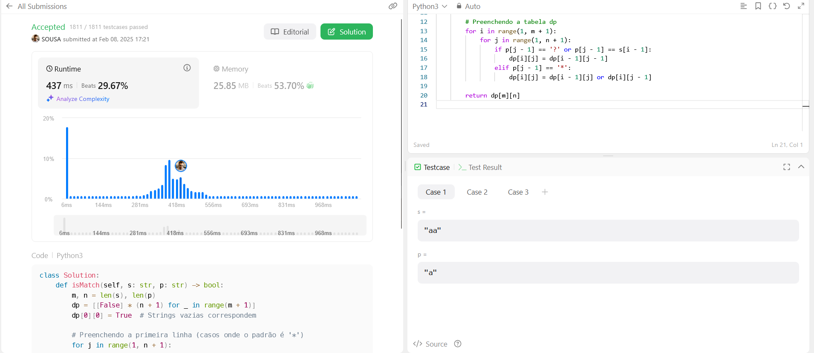

# LeetCodeProblemas

**Número da Lista**: 20 
**Conteúdo da Disciplina**: Programação Dinâmica (PD) 

## Alunos
|Matrícula | Aluno |
| -- | -- |
| 22/1021886  |  Cássio Sousa dos Reis |
| 22/1039497  |  Márcio Henrique de Sousa Costa |

## Sobre 
Este projeto tem como objetivo a resolução de exercícios da plataforma de juíz online LeetCode sobre o conteúdo de Programação Dinâmica (PD).

## Screenshots
Adicione 3 ou mais screenshots do projeto em funcionamento.

**62. Unique Paths** 

**44. Winldcard Matching** 

## Instalação 
**Linguagem**: python3.x 
**Framework**: nenhum 
Descreva os pré-requisitos para rodar o seu projeto e os comandos necessários.

## Uso 
Para rodar os códigos, primeiro acesse o site do LeetCode, faça login e pesquise a questão. Depois, selecione a linguagem correta, copie e cole o código na aba "Code", e clique em "Run" para testar ou "Submit" para enviar a solução.

## Outros 
Quaisquer outras informações sobre seu projeto podem ser descritas abaixo.

